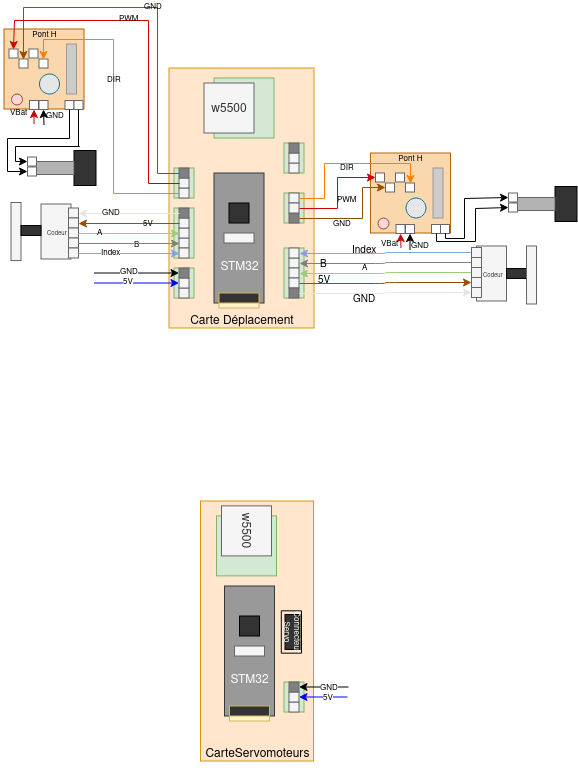

# Cablage du Robot

Pour le cablage de la carte déplacement, il y a le schéma suivant :

Les conventions couleurs sont celles décrites sur le côté des roues codeuses, n'hésitez pas à vous y réferer !
