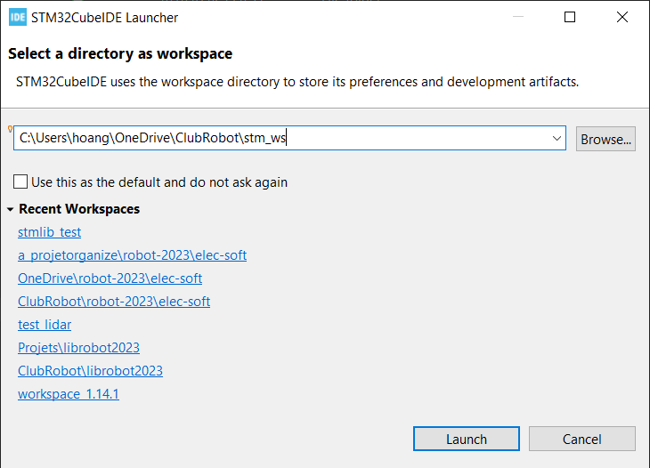
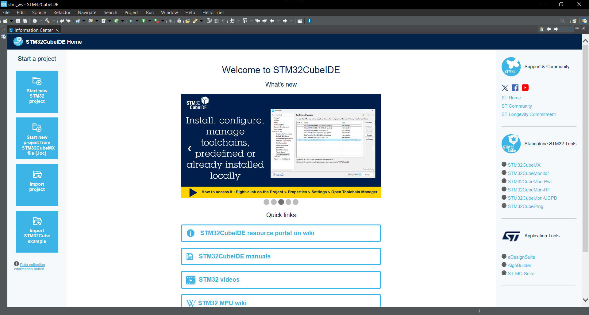
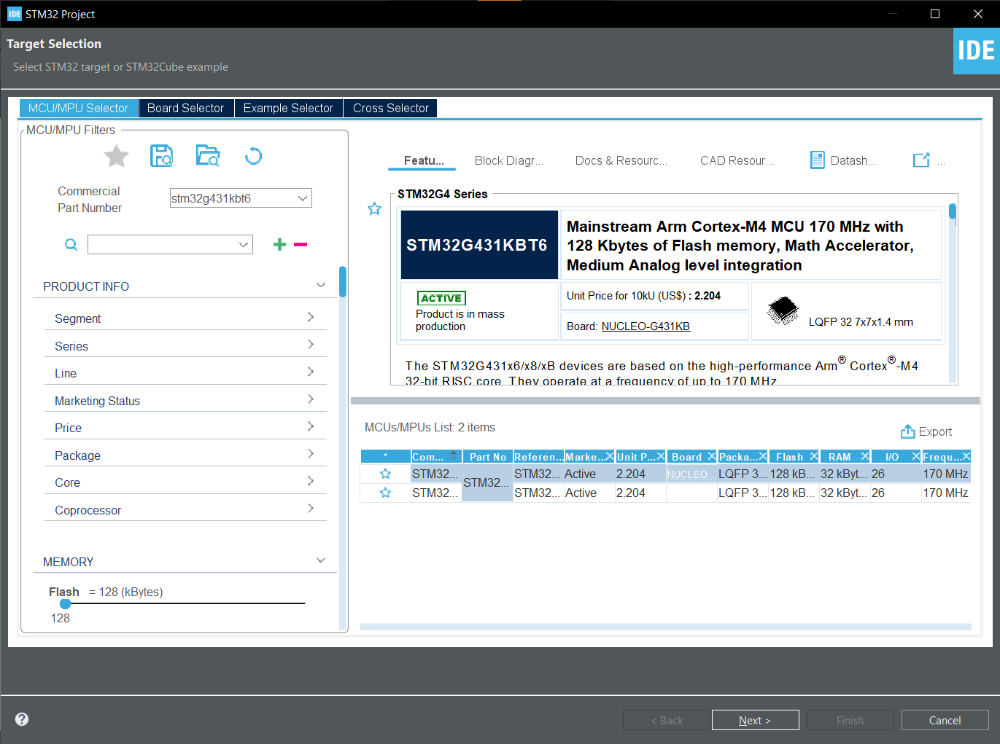
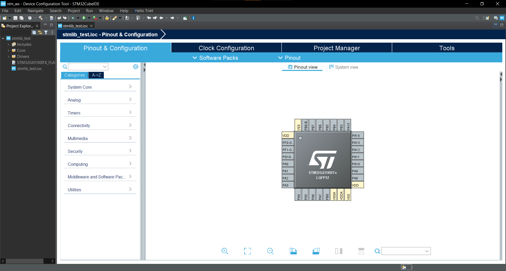

# Guide de création d'un nouveau projet STM32CubeIDE

Un project STM32CubeIDE contient le code source, les fichiers de configuration et les fichiers de compilation pour un projet STM32. Ce guide vous montrera comment créer un nouveau projet STM32CubeIDE.

## Step 1: Créer un nouveau workspace
D'abord, lance STM32CubeIDE. Vous devriez voir une fenêtre qui ressemble à ceci:



Vous devez choisir un "workspace" pour stocker vos projets. 

Un workspace est un dossier qui contient plusieurs projets et la configuration de l'IDE.

Cliquez sur "Browse" pour choisir un dossier pour votre workspace. Une fois que vous avez choisi un dossier, cliquez sur "Launch" pour ouvrir STM32CubeIDE.

## Step 2: Créer un nouveau projet

Vous arriverez sur la page d'accueil de STM32CubeIDE. Pour créer un nouveau projet, cliquez sur "Start new STM32 Project".



### Choisir le microcontrôleur
*Microcontrôleur pour 2024 :*
```
STM32G431KBT6
```
Une fois cliqué sur "Start new STM32 project", vous devriez voir une fenêtre pour choisir le microcontrôleur que tu veux utiliser:



Entrez "STM32G431KBT6" dans la barre de recherche pour trouver le microcontrôleur que vous voulez utiliser. Cliquez sur "Next" pour continuer.

### Nommer le project
Choissisez un nom pour votre projet. Cliquer sur "Finish" pour créer le projet.

Vous arrivez en suite sur la page de configuration du microcontrôleur. 



## Ensuite
Voir ensuite dans [Configuration d'un STM](peripheral_config.md) pour configurer votre STM32.

Ou dans [Configurer ton project](project_config.md) pour configurer ton project STM32CubeIDE.


