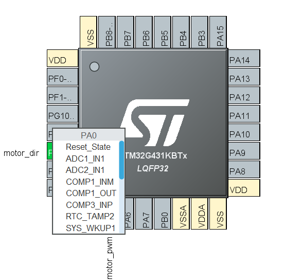
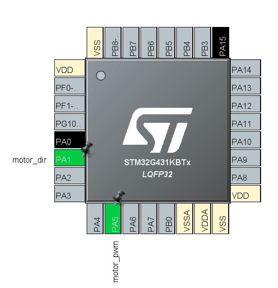
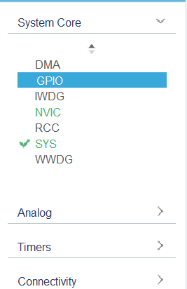
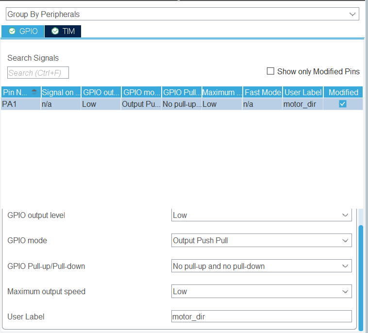
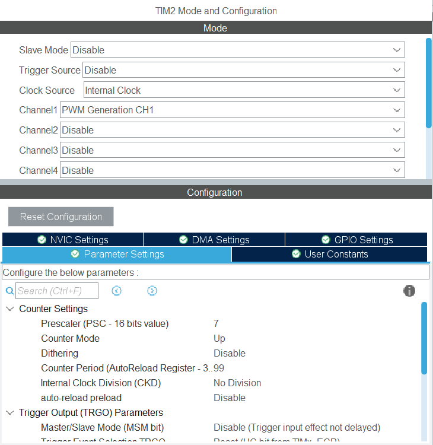

# Guide pour configurer d'un STM32

Oula, ce sujet est très vaste. On essaie de couvrir le minimale pour avoir une idée, après ça dépend vraiment chaque périphérique.

D'ailleur, si tu ne comprends pas ce que c'est un périphérique, je te conseille de lire [ce document](../stm32/index.md).

**Notes**:
L'outil de configuration de périphérique va auto-générer le code pour configurer les périphériques.
Après avoir configuré, clique sur ce bouton :


**Pour accéder à l'outil de configuration** de périphérique, clique sur le fichier `.ioc`.

## Table des matières
- [Pin](#pin)
- [GPIO](#gpio)
- [Timer](#timer)
- [Clock](#clock)
- [UART](#uart)

## Pin
Un pin est une broche de sortie ou d'entrée. Il peut être relier à un "Entrée/Sortie Général" (GPIO), ou à un périphérique spécifique (Timer, UART, SPI, etc).

***Pour configurer un pin***, cliquez sur le pin dans le schéma de votre microcontrôleur. Vous pouvez choisir entre plusieurs options.



Souvent, autre que le GPIO, le pin sera automatiquement assigné à une fonction quand tu configure une périphérique. 

***Pour trouver un pin alternative qui peut assure la même fonction***, gardez Ctrl puis cliquez sur le pin. Vous devez voir les pins alternatives clignotent. Cliquez sur un pin pour le choisir.



## GPIO
Pour la théorie des GPIO, voir [ce document](../stm32/gpio.md).

***Pour commencer***

Choisissez le fenêtre de configuration de GPIO ici : 


**Quelques configurations indispensables pour un GPIO:**
- Mode: Output Push-Pull, Output Open-Drain, Input, Analog
- Pull-up/Pull-down: seulement pour les modes Input
- User Label: pour identifier le pin

***Exemple**:*

Configurer un GPIO pour un sortie '0' et '1' "normal" : 
- Mode: Output Push-Pull
- User Label: `motor_dir`



**Notes:** 
Tu peux nommer les pins utilsés par un autre périphérique dans les onglets correspondants (voir image ci-dessus, en haut à gauche).

## Timer

Un Timer peut servir à plusieurs choses :
- Générer des interruptions à intervalles réguliers
- Mesurer le temps (compter)
- Générer des signaux PWM
- Compter des événements externes

Voir [ce document](../stm32/timer.md) pour plus d'informations.

### Pour générer un PWM


- Choisir le Clock Source (normalement, c'est le clock interne du microcontrôleur)
- Choisir un channel et asigner le mode PWM Generation CHx pour ce channel (un pin sera automatiquement assigné à ce channel)
- Configurer la fréquence du signal PWM en changant la "Prescaler" et la "Counter Period"

```
pwm_frequency = clock_frequency / [(prescaler+1) * (counter_period+1)]
```


## Clock

## UART
