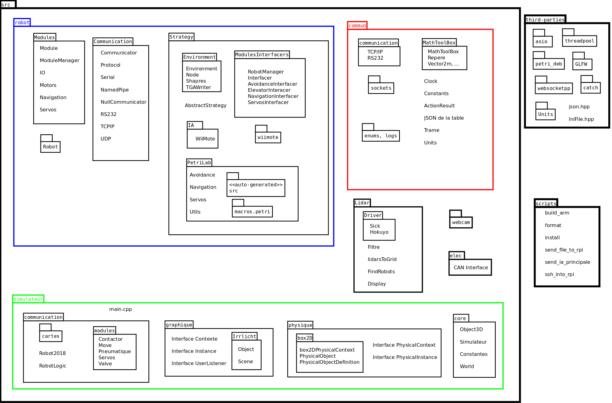

# Vue globale du projet

En étant à la racine du dossier, je t'invite à exécuter ces deux commandes :

```bash
$ find src -type f | wc -l
678

$ find src -type f | xargs wc -l
186823 total
```

Il y a actuellement 678 fichiers source pour presque 200.000 lignes de code ; je te l'accorde c'est beaucoup.

Bien sûr, tous ces fichiers sont structurés et ce petit schéma peut te donner une idée des merveilles que tu peux trouver dans le dossier `src/` :



Bien entendu, ce fichier est à mettre à jour en fonction des nouvelles fonctionnalités apportées, et si tu veux y participer il faut utiliser le logiciel [dia](https://wiki.gnome.org/Apps/Dia/).
```
sudo apt-get install dia
```

Comme tu peux t'en apercevoir, il y a trois parties principales :
* [```commun```](https://github.com/ClubRobotInsat/info/tree/develop/src/commun/) - Tu peux y retrouver plein d'outils qui facilitent la programmation (manipulation d'unités physiques, constantes, manipulation de la communication, ...). Ce dossier est hyper important, mais je te conseille dans un premier temps d'utiliser les outils pour travailler sur le reste avant de te plonger dans ces librairies (certaines notions sont un peu compliquées et tout ce code n'est pas forcément directement lié à la robotique).
* [```simulateur/```](https://github.com/ClubRobotInsat/info/tree/develop/src/simulateur/) - Ce dossier regroupe l'ensemble des fichiers nécessaires pour mettre au point un simulateur graphique qui nous permet de tester la stratégie du robot avant de l'avoir en vrai, mécaniquement parlant. Si tu veux en savoir plus sur l'architecture du simulateur, elle est détaillée [ici](simu.md).
* [```robot/```](https://github.com/ClubRobotInsat/info/tree/develop/src/robot/) - Il y a toute la stratégie, les interfaces de manipulation des actionneurs, ... C'est dans ce dossier que la majorité du code est écrit, et c'est bien sûr la partie la plus ancrée avec les autres pôles.

## Présentation des abstraction informatiques autour du robot

En informatique, il y a de nombreuses couches d'abstraction qui séparent les cartes électroniques de l'IA du match. Je te propose un petit aperçu de ces couches, des explications supplémentaires et spécifiques à chaque couche te seront apportées en suivant.

***CE TABLEAU DOIT ÊTRE MIS À JOUR***

<style type="text/css">
.tg  {border-collapse:collapse;border-spacing:0;border-color:#999;}
.tg td{font-family:Arial, sans-serif;font-size:14px;padding:10px 5px;border-style:solid;border-width:1px;overflow:hidden;word-break:normal;border-color:#999;color:#444;background-color:#F7FDFA;}
.tg th{font-family:Arial, sans-serif;font-size:14px;font-weight:normal;padding:10px 5px;border-style:solid;border-width:1px;overflow:hidden;word-break:normal;border-color:#999;color:#fff;background-color:#26ADE4;}
.tg .tg-uys7{border-color:inherit;text-align:center}
.tg .tg-us36{border-color:inherit;vertical-align:top}
.tg .tg-xrpy{font-weight:bold;font-size:18px;border-color:inherit;text-align:center}
</style>
<table class="tg">
  <tr>
    <th class="tg-xrpy" colspan="5">Couches d'abstraction</th>
    <th class="tg-xrpy">Explications brèves</th>
    <th class="tg-xrpy" colspan="2">Localisation</th>
  </tr>
  <tr>
    <td class="tg-uys7" colspan="5">Petrilab</td>
    <td class="tg-uys7"><span style="font-weight:bold">Interface graphique</span> pour créer les stratégies</td>
    <td class="tg-uys7" colspan="2"><a href="https://github.com/ClubRobotInsat/info/tree/develop/src/robot/Principal/petri/">src/robot/Principal/petri/</a></td>
  </tr>
  <tr>
    <td class="tg-uys7">IAPrincipale</td>
    <td class="tg-uys7">IAWiiMote</td>
    <td class="tg-uys7">IATests</td>
    <td class="tg-uys7">IATestLidar</td>
    <td class="tg-uys7">...</td>
    <td class="tg-uys7"><span style="font-weight:bold">Exécution</span> de la <span style="font-weight:bold">stratégie</span> / tests haut niveau</td>
    <td class="tg-uys7" colspan="2"><a href="https://github.com/ClubRobotInsat/info/tree/develop/src/robot/Principal/IA/">src/robot/Principal/IA/</a></td>
  </tr>
  <tr>
    <td class="tg-uys7" colspan="2">Stratégie</td>
    <td class="tg-uys7" colspan="3">MecaManager</td>
    <td class="tg-uys7"><span style="font-weight:bold">Couleur</span>, <span style="font-weight:bold">repère</span>, temps, tirette ; fonctions <span style="font-weight:bold">haut niveau</span></td>
    <td class="tg-uys7"><a href="https://github.com/ClubRobotInsat/info/tree/develop/src/robot/Principal/librobot/Strategie.h">Strategie.h</a></td>
    <td class="tg-us36"><a href="https://github.com/ClubRobotInsat/info/tree/develop/src/robot/Principal/librobot/MecaManager.h">MecaManager.h</a></td>
  </tr>
  <tr>
    <td class="tg-uys7" colspan="5">RobotPrincipal <span style="font-style:italic">(public RobotCommun)</span></td>
    <td class="tg-uys7"><span style="font-weight:bold">Assignation</span> des cartes pour <span style="font-weight:bold">2018</span><br></td>
    <td class="tg-uys7" colspan="2"><a href="https://github.com/ClubRobotInsat/info/tree/develop/src/robot/Principal/librobot/Robot.h">src/robot/Principal/librobot/Robot.h</a></td>
  </tr>
  <tr>
    <td class="tg-uys7" colspan="5">RobotCommun <span style="font-style:italic">(virtual)</span></td>
    <td class="tg-uys7"><span style="font-weight:bold">Com'</span>, <span style="font-weight:bold">adversaire</span>, <span style="font-weight:bold">déplacements</span>, cartes</td>
    <td class="tg-uys7" colspan="2"><a href="https://github.com/ClubRobotInsat/info/tree/develop/src/robot/Commun/Robot.h">src/robot/Commun/Robot.h</a></td>
  </tr>
  <tr>
    <td class="tg-uys7">Déplacement</td>
    <td class="tg-uys7">Servos</td>
    <td class="tg-uys7">Moteurs<br></td>
    <td class="tg-uys7">Évitement<br></td>
    <td class="tg-uys7">...</td>
    <td class="tg-uys7"><span style="font-weight:bold">Interfaces</span> bloquantes</td>
    <td class="tg-uys7" colspan="2"><a href="https://github.com/ClubRobotInsat/info/tree/develop/src/robot/Commun/">src/robot/Commun/</a></td>
  </tr>
  <tr>
    <td class="tg-uys7" colspan="5">Cartes électroniques</td>
    <td class="tg-uys7">Communication par <span style="font-weight:bold">trames</span></td>
    <td class="tg-uys7" colspan="2"><a href="https://github.com/ClubRobotInsat/info/tree/develop/src/robot/Cartes/">src/robot/Cartes/</a></td>
  </tr>
</table>
