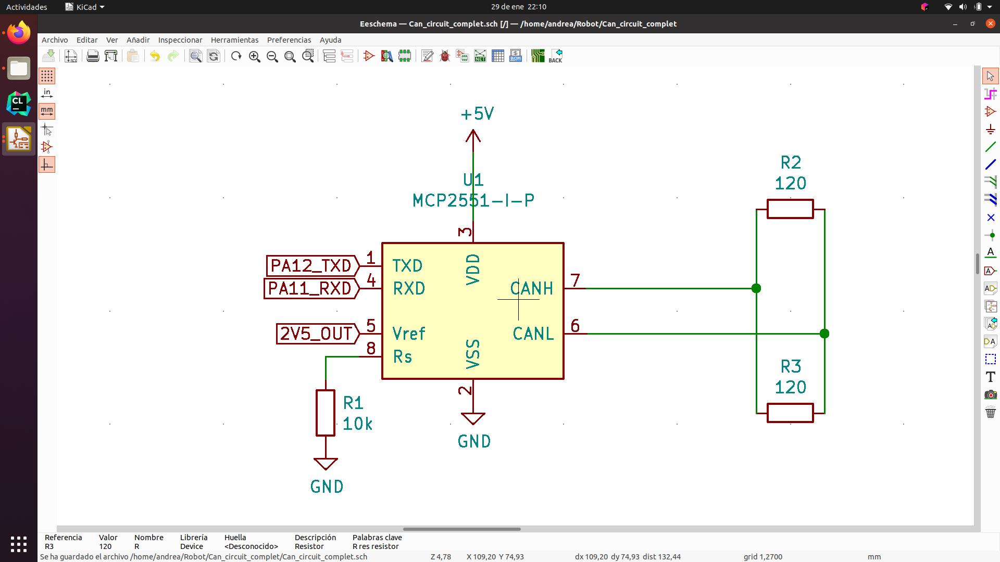
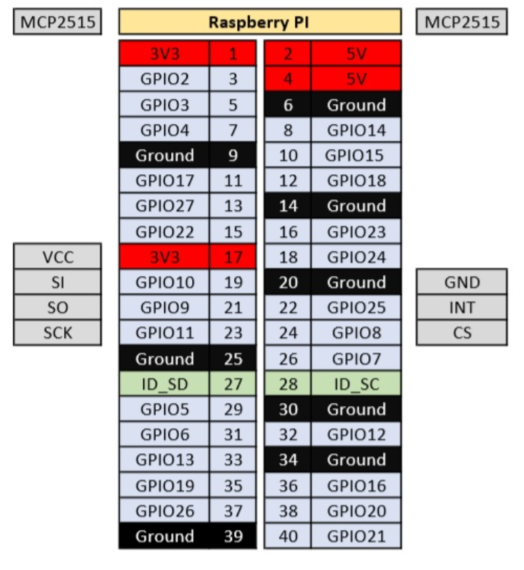
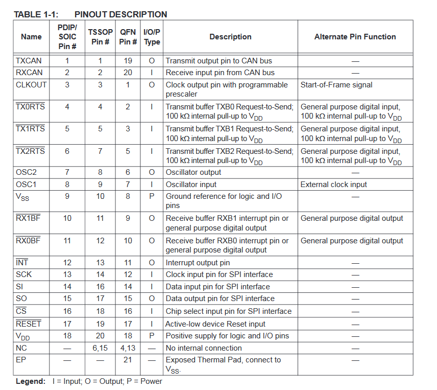
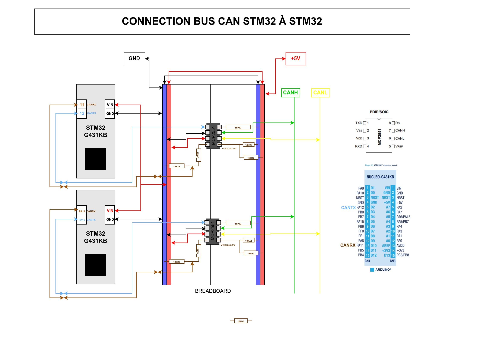

# Communication avec le hardware

La communication avec le hardware est essentielle pour assurer le bon fonctionnement du robot. Cette section se concentre sur le bus CAN, un choix stratégique en raison de sa robustesse et de sa rapidité.

## Qu'est ce que le Bus CAN ?

Le bus CAN (Controller Area Network) est un bus de communication série largement utilisé dans l'industrie. Il offre une communication rapide et fiable avec plusieurs modules simultanément. Pour en savoir plus sur son fonctionnement, consultez ces documents:
- [Description générale du fonctionnement](https://www.ti.com/lit/an/sloa101b/sloa101b.pdf?ts=1633140726383&ref_url=https%3A%2F%2Fwww.google.com%2F)
- [tutoriel explicatif](https://www.csselectronics.com/pages/can-bus-simple-intro-tutoria).

## Matériel utilisé pour le bus CAN

CAN Transceiver : Composant intermédiaire pour produire les signaux CANL et CANH et les transporter dans le réseau.

On utilise 2 modèles. On utilise le **MCP2515** et le **MCP2551**.

Datasheets:
- [Datasheet MCP2551](https://ww1.microchip.com/downloads/en/DeviceDoc/20001667G.pdf)
- [Datasheet MCP2515](https://ww1.microchip.com/downloads/en/DeviceDoc/MCP2515-Stand-Alone-CAN-Controller-with-SPI-20001801J.pdf)

### Différence entre MCP2515 et MCP2551

Le **MCP2515** est un contrôleur CAN qui permet de communiquer avec le bus CAN via SPI. Il est utilisé pour envoyer et recevoir des messages CAN. Il est connecté à la Raspberry Pi via SPI.

Le **MCP2551** est un transceiver CAN plus simple qui permet de convertir les signaux TX et RX en signaux CANH et CANL. Il est compris dans le MCP2515 mais on l'utilise aussi pour communiquer avec la STM32.

## Utilisation du bus CAN

### Paramètres d'alimentation du bus

- Alimentation : **5V**
- Courant : 100mA (en mémoire dans M3)
- Ne pas oublier de mettre un bouchon d'impédance (50 OU 120 Ohm) en fin du cable CAN

### Connexion du MCP2551 (Pour STM32)

**Réglage du slope-rate** :

Pour changer le slope-rate on change la valeur de R connecter sur RS.

### Connexion du MCP2515 (SPI+CAN -> Raspberry Pi)

Connecter les pins du transceiver SI, SO, SCK, INT et CS comme ci dessous. 

:warning: Le VCC doit être sur du **5V** contrairement à ce schéma, ne pas oublier le ground. 

### Exemple de connexion entre deux STM32 

⚠️
 Regarder plus en détail la page dédiée à la communication entre STM32 pour plus d'informations.

## Tutoriel pour la mise en place du bus CAN sur la Raspberry Pi

**Liste des étapes à suivre**:

- [ ] Faire le circuit de la figure ci-dessus entre deux STM32
- [ ] S'assurer que le bus CAN marche entre les deux STM32
- [ ] Connecter le MCP2515 à la Raspberry Pi comme sur la figure ci-dessus
- [ ] Installer les paquets nécessaires sur la Raspberry Pi
- [ ] Vérifier que l'interface can0 est bien présente au démarrage de la raspi avec `ifconfig`
- [ ] Vérifier que la Raspberry Pi reçoit bien les messages envoyés par les STM32 et vice-versa

### Liste des potentiels problèmes

- [ ] Vérifier que le bus CAN est bien alimenté (bouton on/off et branchements…)
- [ ] Vérifier que les fils sont bien branchés
- [ ] Vérifier que les résistances de terminaison sont bien présentes
- [ ] Vérifier que les ground sont bien connectés entre eux
- [ ] Vérifier que le montage est correct
- [ ] Vérifier que les STM32 sont bien alimentés
- [ ] Vérifier que les STM32 sont bien programmés pour envoyer et recevoir des messages CAN
- [ ] Vérifier que les signaux TX et RX sont bien connectés aux pins RX et TX des STM32
- [ ] Vérifier que les signaux sont bien présents sur le BUS CAN (oscilloscope ou serial analyzer)
- [ ] Vérifier que les bonnes données sont envoyées et reçues par les STM32
- [ ] Vérifier que les signaux envoyés par les STM32 sont bien reçus par la Raspberry Pi
- [ ] Vérifier que les modules SPI et CAN sont bien activés sur la Raspberry Pi
- [ ] Vérifier que les paquets nécessaires sont bien installés sur la Raspberry Pi
- [ ] Vérifier que l'interface can0 est bien présente au démarrage de la raspi avec `ifconfig`
- [ ] Vérifier que la Raspberry Pi reçoit bien les messages envoyés par les STM32 et vice-versa

## Vérification du bon fonctionnement du bus CAN sur la Raspberry Pi

### Vérification de l'interface can0:

- Vérifier que l’interface can0 est bien présente au démarrage de la raspi avec `ifconfig`
- On peut aussi vérifier dans les messages de démarrage du kernel que tout s’est bien passé avec `dmesg | grep can` et `dmesg | grep mcp`
- Sinon, redémarrer la raspi `sudo reboot`

### Format des messages

- `candump any` pour recevoir (en boucle)
- `cansend can0 000#00.00.00.00.00.00.00.00` pour envoyer (attention, données en hexa).

## Documentation diverse

Explorez ces ressources pour une compréhension plus approfondie du bus CAN et de son utilisation.

- [Guide rapide](https://forums.raspberrypi.com/viewtopic.php?t=141052)

- [Adding CAN to the Raspberry PI](https://www.beyondlogic.org/adding-can-controller-area-network-to-the-raspberry-pi/)
- [How to connect Raspberry Pi to CAN bus](https://projects-raspberry.com/how-to-connect-raspberry-pi-to-can-bus/)
- [ Not able to setup can0. - Raspberry Pi Forums](https://forums.raspberrypi.com/viewtopic.php?t=311606)

- [MCP251x failes setup CAN-bus communication with error=110 · Issue #4183 · raspberrypi/linux](https://github.com/raspberrypi/linux/issues/4183)

## Notes
- Description générale du fonctionnement:  [https://www.ti.com/lit/an/sloa101b/sloa101b.pdf?ts=1633140726383&ref_url=https%3A%2F%2Fwww.google.com%2F](https://www.ti.com/lit/an/sloa101b/sloa101b.pdf?ts=1633140726383&ref_url=https%253A%252F%252Fwww.google.com%252F)

si ça marche pas, vérifier qu’il y a bien deux dispositifs sur le bus 

[CAN Bus Explained - A Simple Intro [2022 | The #1 Tutorial]](https://www.csselectronics.com/pages/can-bus-simple-intro-tutorial)

[GitHub - TVAROBOT/STM32: CAN bus on STM32F103C8T6 "Blue pill" uVision and CubeMX](https://github.com/TVAROBOT/STM32)

[CAN Bus](../ToDo%20d9dc46c3b25c4135a14d9b95735317f5/Decide%20communication%20protocol%20d89cb22bfdd24c7198646a51b15ae670/CAN%20Bus%20b5e77c9cfda440c08deaae066f118232.md)

datasheet : [https://ww1.microchip.com/downloads/en/DeviceDoc/MCP2515-Stand-Alone-CAN-Controller-with-SPI-20001801J.pdf](https://ww1.microchip.com/downloads/en/DeviceDoc/MCP2515-Stand-Alone-CAN-Controller-with-SPI-20001801J.pdf)

[[quick-guide] CAN bus on raspberry pi with MCP2515 - Raspberry Pi Forums](https://forums.raspberrypi.com/viewtopic.php?t=141052)

[Adding CAN to the Raspberry PI](https://www.beyondlogic.org/adding-can-controller-area-network-to-the-raspberry-pi/)

apparemment c’est un problème de fils, j’ai les mêmes erreurs qu’ici : 

[[SOLVED] Not able to setup can0. - Raspberry Pi Forums](https://forums.raspberrypi.com/viewtopic.php?t=311606)

[MCP251x failes setup CAN-bus communication with error=110 · Issue #4183 · raspberrypi/linux](https://github.com/raspberrypi/linux/issues/4183)

utilisation : cansend can0 <id>#{data}

id sur 3 nombres

[candump(1) - can-utils - Debian testing - Debian Manpages](https://manpages.debian.org/testing/can-utils/candump.1.en.html)

candump any reçoit en boucle 

finalement on va laisser tomber spidev et utiliser bash directement 

librairie python : spidev (jamais utilisé) 

[https://pypi.org/project/spidev/](https://pypi.org/project/spidev/)

[https://www.sigmdel.ca/michel/ha/rpi/dnld/draft_spidev_doc_fr.pdf](https://www.sigmdel.ca/michel/ha/rpi/dnld/draft_spidev_doc_fr.pdf)

[https://raspberrypi-aa.github.io/session3/spi.html](https://raspberrypi-aa.github.io/session3/spi.html)