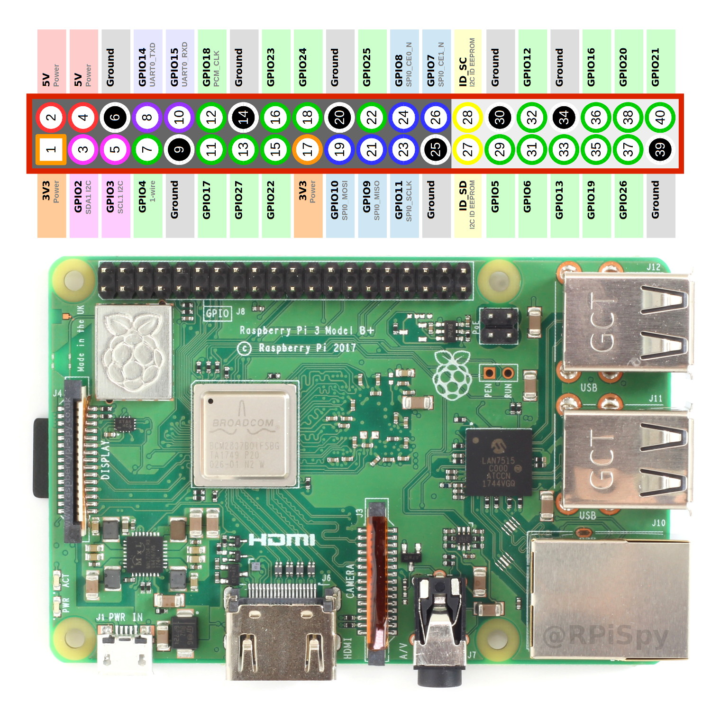

# Connexion à la Raspberry

# Raspberry Pi
La Raspberry Pi a maintenant un serveur DHCP fonctionnel 
## Quoi que c'est le DHCP? 
C'est le truc qui vous permet d'avoir automatiquement une @IP sans jamais aller toucher aux paramètres de votre pc ou de la raspi, et donc d'avoir une connectivité qui marche sans rien faire, donc c'est cool 
## Comment que je m'en sers? 
Il suffit de brancher votre pc au port ethernet de la raspi. Si ladite raspi est allumée (branchée), vous aurez une adresse IP sur votre ordi (mais vous n'avez pas besoin de vous en soucier), et surtout, vous pourrez vous connecter en ssh à la raspi 
## OK, comment je me connecte en ssh? 
``ssh pi@192.168.169.1`` 
## Aude, ça marche pas! 
- est-ce que les LEDs du port ethernet de la raspi et du PC sont allumées? 
- sinon, rebrancher le câble comme il faut, vérifier l'alim des deux dispositifs 
- est-ce que mon PC a bien reçu une adresse IP sur le réseau 192.168.169.0/24? ``ifconfig`` 
- sinon, sur la raspi, vérifier le statut du serveur DHCP ``systemctl status isc-dhcp-server`` 
### J'arrive à ping la raspi, mais pas à SSH 
- probablement un problème de firewall, bonne chance jeune padawan (cherche comment utiliser le firewall ufw sur internet) 
## Je peux te contacter si ça marche pas? 
Oui bien sûr ^^


## Connexion en ssh

> user : pi mdp : robotcdf
> 

pour se connecter en ssh à la raspi : 

- en wifi : vérifier qu’on est sur le même réseau (ex : partage de connexion, réseau IoT si j’arrive à chopper le mdp)
    - ip_address généralement en 192.168.X.X ou 10.X.X.X (privée)
- en ethernet : connecter le pc et la raspi avec un câble ethernet (si besoin adaptateur usb)

Si les led des ports ethernet ne s’allument pas, tout reboot 

1. vérifie qu’il y a une ipv6 (commençant pas fe80::) sur l’interface de la raspi et de ton pc (elles ont sûrement des noms bizarres commençant par en) : ça veut dire que la connexion est possible 
    - si pas d’ipv6, débranche et rebranche, vérifie toutes les interfaces
2. essaie de ping la raspi depuis ton pc (facultatif : ping ton pc depuis la raspi, mais les windows ne répondront pas dans tous les cas) 
    - si ton pc a une ipv4  en 169.254.X.X (link-local)
        - toutes les fois où j’ai testé la raspi avait la 169.254.217.11/16
        - celle avec le scotch a été mise en static à 169.254.0.1/16
        
        ⇒ rentre la commande suivante sur ton pc 
        
        ```bash
        ping ipv4_raspi # si le ping ne passe pas, vérifie la connectivité 
        # et/ou essaie en ipv6 
        # tu peux aussi entrer la commande 
        route # pour vérifier la table de routage si tu es expérimenté 
        ```
        
    - si ton pc n’a pas d’ipv4 sur l’interface
        
        ⇒ ping la raspi en ipv6 
        
        ```bash
        ping -6 ipv6_raspi%interface
        ```
        
3. se connecter en ssh 
    - ipv4
    
    ```bash
    ssh pi@ipv4_raspi
    ```
    
    - ipv6
    
    ```bash
    ssh pi@ipv6_raspi%interface
    ```
    

Tu peux utiliser un connecteur sur ton ide (par exemple sur vscode) une fois que le ssh fonctionne 

(PC Aude : Adaptador de Ethernet Ethernet: 169.254.239.119)



## Install OpenCV

[How to Install OpenCV on Raspberry Pi 3](https://linuxize.com/post/how-to-install-opencv-on-raspberry-pi/)