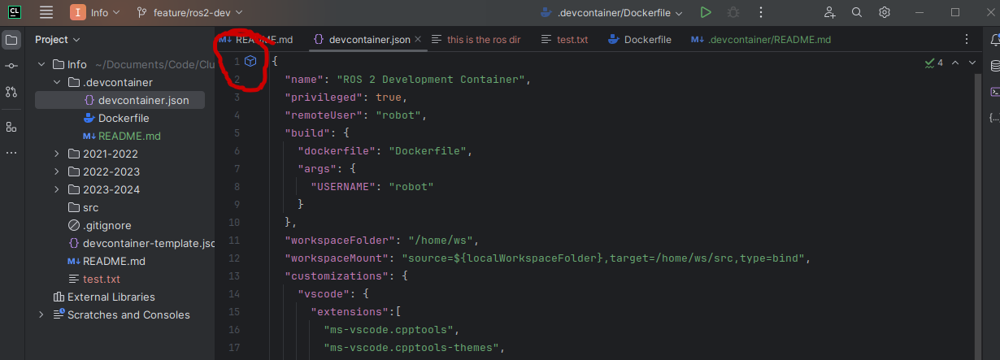
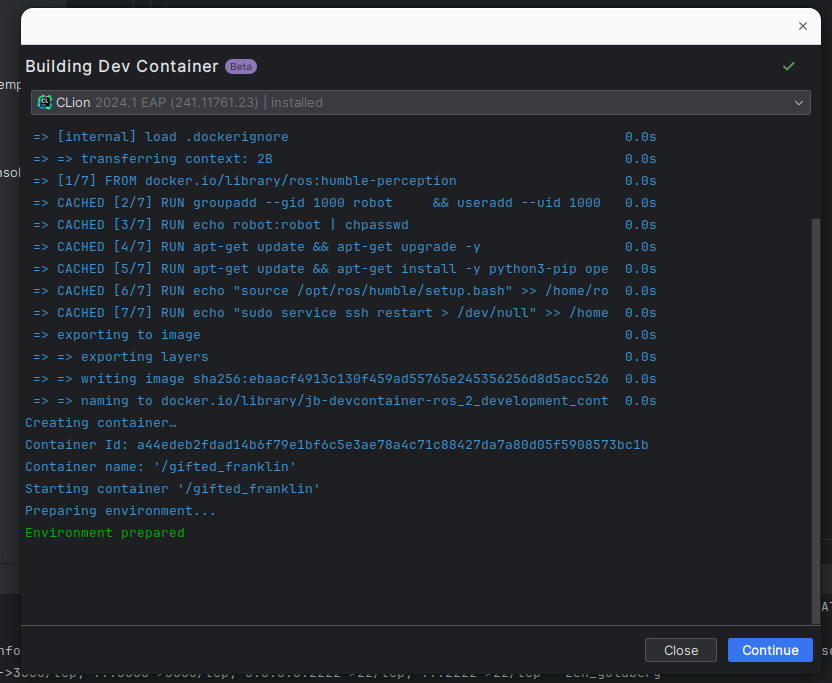

# How to start the development container for 🤖 ROS2 development

1. 🛠 Install VSCode or a JetBrainsIDE(Clion or Pycharm recommended). For JetBrains you have free student licences. 
I personally recommend a JetBrians IDE over VSCode.
2. 🐳 Install [docker engine](https://docs.docker.com/engine/install/). 
In linux don't forget to [add yourself to the docker group](https://docs.docker.com/engine/install/linux-postinstall/):
   1. ```sudo groupadd docker```
   2. ```sudo usermod -aG docker $USER```
   3. ```newgrp docker```
3. 📚 git clone https://github.com/ClubRobotInsat/Info
4. If you're on windows you need to comment 
the ```"source=/tmp/.X11-unix,target=/tmp/.X11-unix,type=bind,consistency=cached"```
line in the ```.devcontainer/devcontainer.json``` file (comment is << // >> as in C) at the end of the file. 
This line allows you to use GUI apps from the container, which doesn't work on windows (no X11 on windows by default).

5. Follow the instruction based on your IDE

# CLion / Pycharm / Other JetBrains
1. Open the project folder
2. Open the ```.devcontainer/devcontainer.json``` file.
3. CLick on the blue cube to create a new dev container, the simplest option is to choose: 
```Create Dev Container and mount sources``` this will make the dev directory inside the container and the 
"real" folder to be synced. This might have performance issues on windows, so if you know what you're doing
it might be worth to take a look at the clone option if you're on windows.


Clion should build the container, it might take some time, good internet can help.
Once its finished press continue:


Again, it might take some time.

Once finished, your IDE should open, you're now in a virtual environment 
with the right version of everything and ros2 installed!

When closing, chose close and stop to avoid performance and ressource
allocation(mostly ports) issues in your PC.


# VSCode
1. Open the project folder
2. press ctr+shift+p
3. Run: ```Dev Containers: Rebuild and Reopen in Container```. It might take some time, good internet can help


## Windows Docker engine install details
Use the recommended settings, you can skip the login and the survey.


# Why and how?
For this tutorial you need to be familiar with the concept of docker container, container ports, and container volumes.
Look up a tutorial if you don't know what those are.

This process creates a container and makes your IDE connect to it as its "host" machine.
This enables people to work with the same exact environment independently of the underlying machine.
SO, basically we are creating a "light VM" so that everyone can work with ROS2 as the only officially 
supported OS for ros2 humble (the latest LTS version when writing this doc) is ubuntu 22.04, which is already 2y old 
and just getting older.
At the same time we are opening a port so that the IDE can connect though it (3000) and another one for ssh connexion
if needed (2222). 
We also mout a volume from our repository into the dev container so that we can have all our files up to date all
the time.
This volume binding, goes through WSL on windows, which makes two "emulation" layers of the fyle system, docker and wls.
THis makes the fyle system really slow, so, cloning the repo inside the container might be wise if 
performance is an issue on someone's PC.

The launch config for the container is specified int he ```.devcontainer/devcontainer.json``` file, replacing
the usual docker-compose.yml or the docker run command. So any container config should be modified here.

All the image config is in the Dockerfile as usual. IF the underlying image needs to be modified its here.

# Debugging the dev-environment
### Port already in use
- ```docker ps```
- This will show a list with all the running containers in your PC, you cant have two containers bind to 
the same port, so if there is one already running it must be stopped. This happens when the IDE doesn't close
the dev-container when closed. It's mostly an issue with VSCode.
- Take the "CONTAINER ID" and run ```docker stop ${CONTAINER ID}```
- Try opening the dev container again, if it doesn't work there is another process using the port,
the simplest way to deal with it is rebooting the machine or changing the host port (the one on the left of the : )
in the ```.devcontainer/devcontainer.json``` file.

### Cant bind a volume
The most usual cause is that the directory doest exist, 
have you forgotten to comment the x11 line in the ```.devcontainer/devcontainer.json``` file?


