# Les fonctions principales à connaitre pour l'utilisation de Creo 9

## Table de matières 
  **Introduction**  
  **I) La Repertoire de travail** 
  **II) Création d'une pièce et l'ouverture d'une existante** 
  **III) L'Interface de Creo** 
    &nbsp; &nbsp; 1) L'Arbre de navigation 
    &nbsp; &nbsp; 2) Le Modèle 
    &nbsp; &nbsp; 3) L'Analyse 
    &nbsp; &nbsp; 4) La Simulation en Direct, l'Annotation, les Outils et la Modélisation Flexible 
    &nbsp; &nbsp; 5) L'Affichage 
    &nbsp; &nbsp; 6) Les Applications 
  **IV) L'Utilisation de ces fonctions** 
    &nbsp; &nbsp; 1) Les Plans et Les Axes 
    &nbsp; &nbsp; 2) L'Esquisse 
    &nbsp; &nbsp; 3) L'Extrusion et La Révolution 
    &nbsp; &nbsp; 4) Les Arrondis et Les Chanfreins 
    &nbsp; &nbsp; 5) La Répétition et La Symétrie 
    &nbsp; &nbsp; 6) Mesurer 
    &nbsp; &nbsp; 7) Les Apparences et Les Sections 
    &nbsp; &nbsp; 8) Le Render Studio 
    &nbsp; &nbsp; 9) L'Assemblage 
  
## Intorduction
Creo Parametric est un logiciel de CAD (Computer-aided design) d'entrée de gamme, c'est-à-dire qu'il est moins intuitif que ses collègues (ex. SolidWorks et Catia), mais la licence de Creo coûte moins cher et, ce qui est important, est fournie par notre école, INSA Toulouse. C'est pourquoi au Club Robot, on utilise Creo. Pour savoir comment installer et configurer Creo 9 avec le compte INSA, voir le document : [Installation de Creo](installation-de-creo.md).  

## I) La Repertoire de travail
La première chose à faire chaque fois que vous lancez votre Creo, c'est le choix du répertoire de travail, c'est-à-dire, vous devez lui indiquer manuellement l'emplacement de votre projet sur votre ordinateur, sinon il ne pourra pas travailler avec les assemblages. C'est une fonction assez pratique car elle permet de ne pas mélanger vos projets et fichiers si vous travaillez sur plusieurs sujets en parallèle.
Pour cela un fois le Creo sera lancée, fermez le pub (oui c'est un popup automatique qui va sauter devant vous tout le temps) et cliquez sur le bouton "Sélectionner le répertoire de travail". Comme dans indiqué sur l'image : 

   

 

Petit conseil : ne mettez pas vos projets sur le bureau, car avec l'accumulation de fichiers, cela peut ralentir le démarrage de l'ordinateur. Rangez-les quelque part dans vos Documents, en traçant bien à quelle année scolaire cela correspond pour vous faciliter l'accès. Exemple : 

   
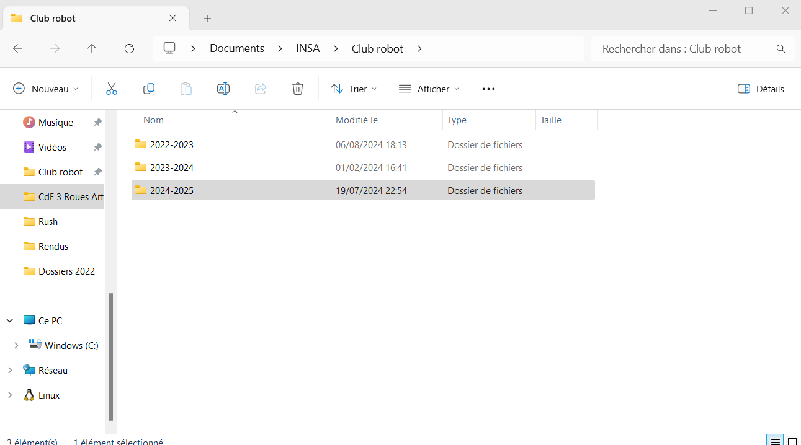
 
   

 

## II) Création d'une pièce et l'ouverture d'une existante
Maintenant, quand Creo a compris où nous allons stocker nos fichiers, nous allons créer une pièce. Il faut appuyer sur "Nouveau" en haut à gauche, et vous allez voir la fenêtre suivante :
  
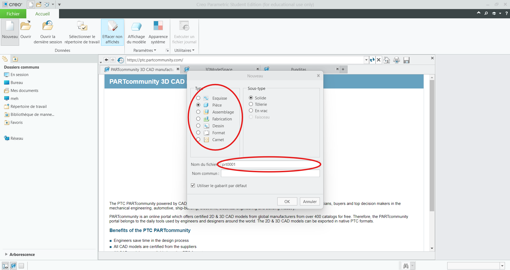
  
On laisse les selections de "pièce", "solide" sans modifications et dans "Nom du ficher" on écrit le nom de notre prècieuse pièce.

 
 

**ATTENTION !!!** Quand vous allez nommer vos fichiers, il va falloir faire l'effort de les rendre intuitifs, et pas de "pièce123" ou des choses de ce genre. N'hésitez pas à donner des noms longs, séparés par des "_", qui seront utiles lors de la gestion de l'assemblage. Ex. "connecteur_moteur_makeblock", "support_bras", "profile_alu_90mm" etc.

 

Une fois le fichier créé, il faut l'enregistrer. Il faut cliquer sur "fichier" en haut à gauche, puis sur "enregistrer" ou simplement faire "ctrl + s" (à favoriser car c'est simplement plus pratique). Normalement il va vous mettre automatiquement dans votre répertoire de travail. 
Maintenant, pour ouvrir une autre ficher, dans la même destination : "fichier" on click "ouvrir" et on choisit le ficher dans la liste. 

Comme montré dans l'image : 
  
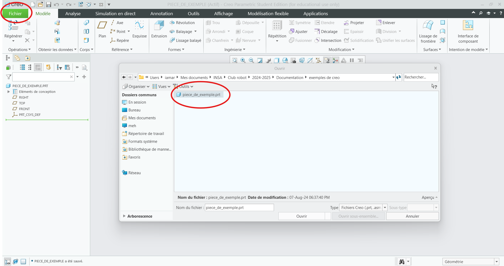
  

## III) L'Interface de Creo

Ici, je vais donner la liste et l'emplacement dans Creo 9 des fonctions importantes à connaître et que l'on utilise le plus. Même si vous allez voir pas mal de critiques envers Creo dans ce guide, il faut quand même admettre que ce logiciel de CAO a beaucoup de fonctions et permet aux personnes qui le maîtrisent entièrement de réaliser de véritables chefs-d'œuvre. Mais pour être honnête, personne n'a envie de découvrir autant Creo (y compris moi). C'est pourquoi vous aurez les fonctions strictement nécessaires à notre niveau (c'est-à-dire pas d'étude de résistance et d'élasticité des matériaux, de propriétés aérodynamiques de nos pièces et encore moins des sculptures de type Blender, car ce n'est pas vraiment utile pour notre projet).

Pour naviguer, on :

  - Roule la molette de la souris : pour zoomer et dézoomer à l'endroit du positionnement du pointeur de la souris.
  - Appuie sur la molette + bouge la souris : pour tourner l'angle de vision de la pièce ou de l'assemblage.
  - Appuie sur la touche Shift (Maj) + appuie sur la molette + bouge la souris : pour déplacer l'angle de vision de la pièce ou de l'assemblage.

**À noter !** La pièce elle-même ne bouge pas dans ce cas-là, mais l'angle sous lequel l'utilisateur voit la pièce.

### 1) L'Arbre de navigation 
L'Arbre de navigation se trouve à notre gauche, comme dans l'image : 

  
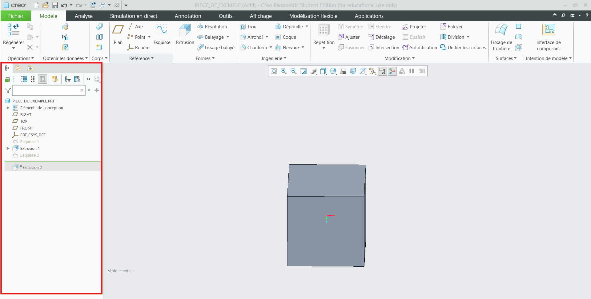
  
 
Ici, on va retrouver les noms de toutes les opérations et fonctions appliquées sur la pièce, ou la liste de toutes les pièces dans les assemblages. L'Arbre de navigation est manipulable, c'est une sorte de trace de vos fonctions que vous pouvez manipuler et l'application va tout recalculer. Vous pouvez bouger la ligne verte afin de masquer les dernières modifications et de "revenir dans le temps". C'est utile quand vous voulez ajouter des modifications post factum sans tout refaire.
On va s'en servir également quand il faudra choisir un élément de la pièce ou de l'assemblage (ex. plans, axes, origines, sous-assemblages, etc.).
Dans une ficher vide, on a quand même notre origine et les plans de Right (vue de profile), Top (vue de dessus) et Front (vue de face) qui sont la base de notre pièce ou de l'assemblage.
### 2) Le Modèle
Dans la partie modèle, on a nos fonctionnalités clés, qui sont entourées dans l'image :

  
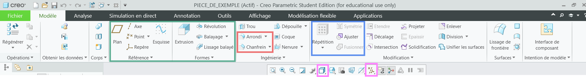
  

**Surlignées en Vert :**
  - Plans : permet de créer des plans quelconques, quand l'orientation ou l'emplacement des plans de base ne suffisent pas
  - Axe : permet de créer des axes, pour faire des rotations ou des alignements autour de ces axes
  - Esquisse : faire une esquisse sur un plan pour ensuite ajouter ou enlever de la matière suivant cette esquisse (la base de la base !)
  - Extrusion et Révolution : des fonctions jumelles qui rendent nos esquisses en 3D, où :
    - L'Extrusion fait cela en projection rectiligne
    - La Révolution le fait en tournant autour d'un axe

**Surlignées en Rouge :**
  - Arrondi et Chanfrein : une autre paire de fonctions de même idée, qui ont pour but principal de rendre notre modèle plus solide, où :
    - Arrondi : comme son nom l'indique, arrondit les angles en y ajoutant (ou en enlevant) de la matière
    - Chanfrein : un peu la même idée que l'arrondi, mais au lieu de quelque chose de rond, on ajoute (ou enlève) un angle plat

**Surlignées en Bleu :**

  - Répétition : sert à répliquer plusieurs fois les autres fonctions (on peut faire des répétitions de tout, même des répétitions de répétitions)
  - Symétrie : sert à simplement faire une réplique en miroir selon un plan (très utile pour les pièces symétriques)

**Surlignées en Violet :**

  - L'Ombrage : rend les pièces mieux visibles, quand vous lancez Creo, il suffit de choisir l'option 2 "L'ombrage avec des arêtes"
  - Affichage : permet de cacher les plans, les axes, les origines et les points ; il va falloir tout cacher pour les grands assemblages, sinon on ne voit rien

 **Cas particulier pour l'Assemblage :**
Cette fenêtre est un peu modifiée pour les assemblages et on y retrouve une fonction cruciale :
  - Assembler : permet d'ajouter, une par une, les pièces dans l'assemblage afin de voir la totalité du système ensemble
  
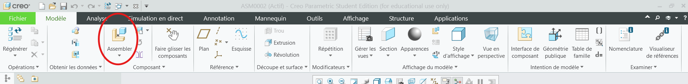
  

### 3) L'Analyse

Drôlement, la seule fonction qu'on utilise ici c'est la "Mesurer", la règle magique qui permet de mesurer les distances, les angles, les rayons entre les plans, les axes et les points. Un outil indispensable lors de la modélisation ! L'Emplacement : 

  
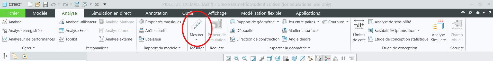
  

### 4) La Simulation en Direct, l'Annotation, les Outils et la Modélisation Flexible
Ces quatres sont à découvrir pour les plus curieux, on n'en a pas besoin pour l'instant.

### 5) L'Affichage
Ici, on a deux fonctions qui nous aident à mieux visualiser nos modèles :
  - Apparences : permet de choisir le matériau et la couleur de la surface de la pièce. Il y a une bibliothèque de matériaux (à chercher en anglais !)
  - Section : permet de découper notre pièce ou l'assemblage pour voir son contenu, sans le détruire (sans modifier l'arbre de navigation)

  
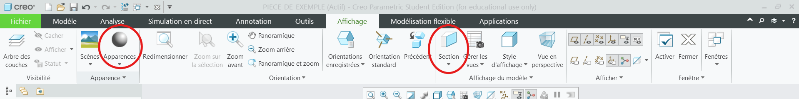
  

### 6) Les Applications 
Dans cette partie, on a l'artillerie lourde que j'ai l'ambition de mettre en place au club un jour, mais c'est un peu overkill pour notre niveau. Donc la seule fonction qu'on utilise ici c'est :

  - Render Studio : permet d'immortaliser nos jolis modèles en haute qualité pour partager entre nous ou pour poster sur les réseaux sociaux
  
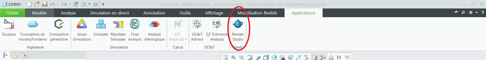
  
**Cas particulier pour l'Assemblage :**
Dans les assemblages, on retrouve dans cette fenêtre une fonction expérimentale (même l'auteur de ce guide ne la maîtrise pas comme il faut) :
  - Câblage : permet de modéliser les câbles beaucoup plus agilement
  
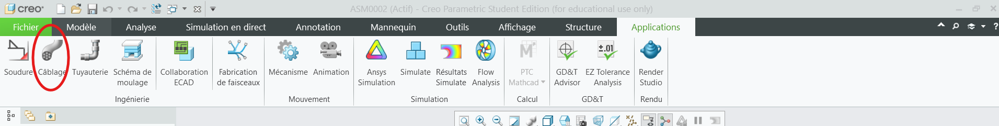
  

## IV) L'Utilisation de ces fonctions
### 1) Les Plans et Les Axes
Dans Creo, pour créer une nouvelle fonction, il faut la baser sur celles existantes. Autrement dit, c'est une chaîne de fonctions basées les unes sur les autres. Ce n'est pas différent pour les plans et les axes. Donc pour les créer, il faut :
  
  1) Appuyer sur la fonction
  2) Choisir le plan ou les plans (en gardant appuyé le Ctrl) par rapport auxquels on veut positionner notre nouveau plan ou nouvel axe
  3) Donner les paramètres (ex. Décaler de 20 mm)
  4) Appuyer sur OK
  5) Visualiser votre nouveau plan ou nouvel axe dans l'arbre de navigation
  6) Se dire bravo

Et c'est aussi simple que ça. Voir le GIF :

  
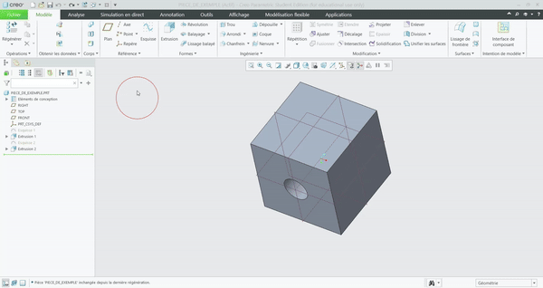
  

### 2) L'Esquisse
#### a) Comment la créer
Comme dit précédemment, l'esquisse est la fonction qui permet de faire le schéma en 2D pour le rendre 3D plus tard. Donc, pour le faire, il faut simplement choisir soit un plan, soit une face pour commencer à travailler.
**À noter !** Creo va essayer de "capturer" votre souris avec des références ; il ne faut pas avoir peur de les utiliser, car ce sont des liens automatiques proposés qui facilitent votre tâche quand vous allez coter (voir plus bas).
Pour entrer dans la rédaction de l'esquisse, il faut faire comme avec les plans :
  1) Appuyer sur "Esquisse"
  2) Choisir le plan ou la face où poser l'esquisse
Voilà un GIF qui montre comment le faire :

  

  
Pour modifier l'esquisse une fois que vous l'avez fermée, il faut appuyer sur cela dans l'arbre de navigation et choisir "Modifier la définition" (le deuxième icône).
#### b) Les Rectangles divers
On a trois types de rectangles qu'on utilise :
  - Rectangle de coin : défini par ses 2 extrémités sur la diagonale
  - Rectangle incliné : défini par son côté et la direction de propagation
  - Rectangle central : défini par son centre et la longueur de ses côtés
Voilà le GIF correspondant :

  
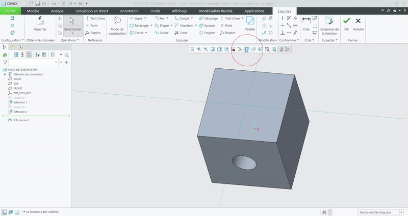
  

#### c) Les Circles
L'utilisation du cercle est très intuitive, il est défini par son centre et son rayon. 
**À noter !** Les cercles créent des axes par défaut que l'on peut utiliser pour d'autres fonctions (cela sera abordé plus tard). 
Voilà un exemple :

  
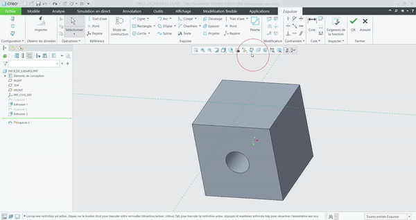
  

#### d) Les Lignes
Les lignes sont utilisées pour faire des formes quelconques. Quand la forme est finie, il faut juste appuyer sur Échap (ESC) pour arrêter la ligne.  
Exemple dans le GIF précédent.
#### e) Les Arcs
Une combinaison intuitive entre les cercles et les lignes afin de faire des demi-cercles. Voici l'exemple :

  
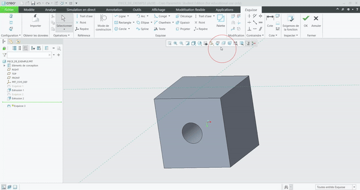
  

#### f) Supprimer les segments 
Un outil qui permet d'enlever des segments afin de créer des formes exotiques tout en gardant les références automatiques qui rends la modélisation plus facile à modifier. Voice le GIF : 
  
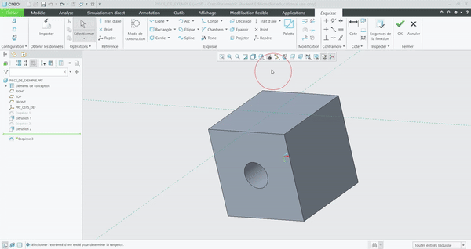
  
#### g) Les Palletes 
Pour les formes un peu plus complexes mais toujours symétriques, nous avons une bibliothèque de formes cachée dans la fonction "Palette". C'est très utile car nos robots sont de base carrés (2022-2023), octogonaux (2023-2024) ou hexagonaux (2024-2025).  
Pour les utiliser, il faut simplement ouvrir la liste, attraper la forme et la tirer vers l'endroit où l'on veut la placer. Ensuite, il suffit juste de donner la taille du paramètre et c'est tout. Voici l'exemple :
 
  
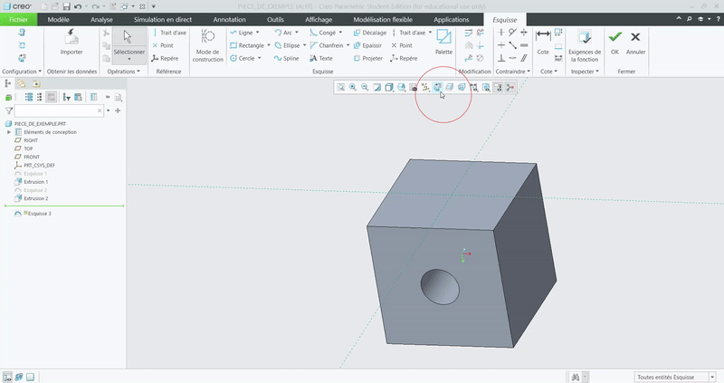
  
#### h) Les Cotes et Les Annotations
And last but not least, les cotes. **C'est l'outil le plus important des esquisses !**
 
Cette fonction sert à donner la taille de toutes les formes vues précédemment. **À noter !**
Creo ne tolère pas d'avoir deux fois la même cote, c'est-à-dire que si vous avez déjà donné suffisamment d'informations pour calculer la taille de votre mesure, il va manifester, car cela peut causer des problèmes. La situation est identique si vous essayez de donner des mesures qui sont en conflit ; dans ce cas-là, Creo va vous proposer de changer votre mesure ou de supprimer vos anciennes mesures pour éliminer le conflit.

Pour l'utiliser, il faut :

  - Appuyer sur "Cote"
  - Choisir la première référence
  - En gardant appuié le Ctrl, choisir la deuxième référence
  - Et en rélachant le Ctrl, appuyer sur la molette (le bouton central de la souris) entre les deux références 
**Attention !** Le type de cote (distance, décalage d'angle, rayon) dépend de l'endroit sur l'esquisse où vous appuyez sur la molette. C'est assez intuitif et vous allez vite comprendre vous-même. Voilà l'exemple :
  
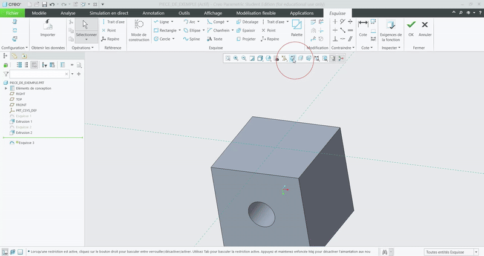
  
 
### 3) L'Extrusion et La Révolution

Une fois votre esquisse prête, vous aurez accès à une nouvelle paire de fonctions : extrusion et révolution. Les deux servent à ajouter ou à enlever de la matière, ni plus ni moins.

#### a) L'Extrusion

- Pour ajouter de la matière, il faut :
  1) Choisir l'esquisse correspondante
  2) Appuyer sur la fonction "Extrusion"
  3) Choisir la profondeur et la direction
Voici un exemple :

  
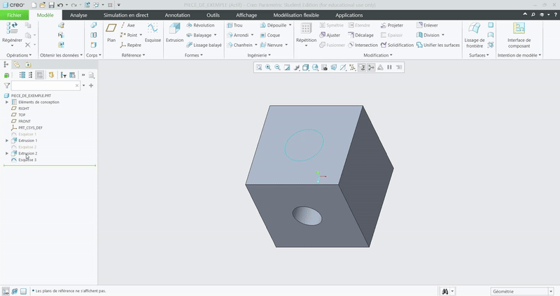
  

- Pour enlever de la matière, il faut :
  1) Choisir l'esquisse correspondante
  2) Appuyer sur la fonction "Extrusion"
  3) Appuyer sur l'option "Enlever de la matière"
  4) Chager la direction
  5) Choisir le mode :
    - Donner la profondeur
    - Changer la référence et indiquer jusqu'où cela doit aller
    - Choisir "à travers tout" pour traverser l'ensemble.

Voici un exemple de trou fait par la profondeur :

  
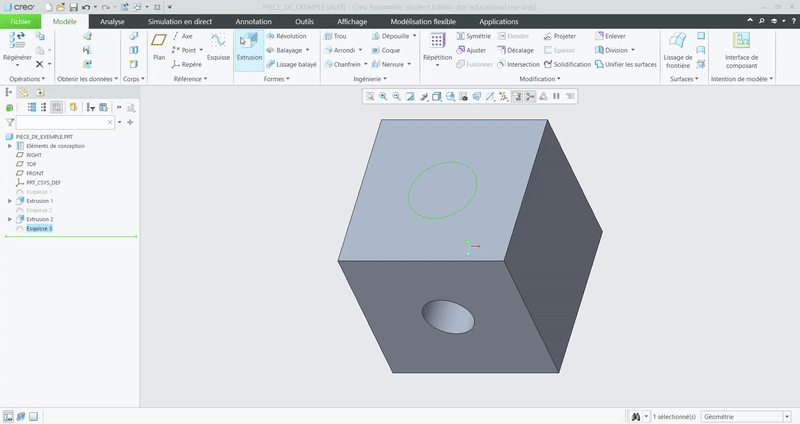
  

Un autre exemple de trou fait par la référence :

  

  

Et un troisième fait par "A travers tout" :

  
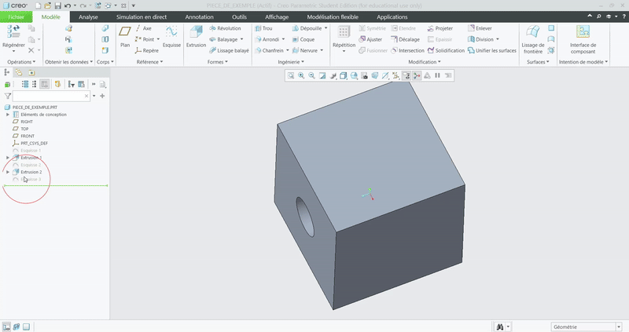
  
 
#### b) La Révolution

La révolution est presque identique à la fonction précédente, avec une différence : elle nécessite d'avoir un axe autour duquel la rotation sera faite.
Donc, pour faire une révolution (sans faire sauter des têtes de rois), il faut :

  1) Choisir l'esquisse correspondante
  2) Appuyer sur la fonction "Révolution"
  3) Choisir l'axe de révolution

Et s'il faut faire un trou, comme pour l'extrusion, il suffit simplement d'appuyer sur "Enlever de la matière".
Voici un exemple :

  
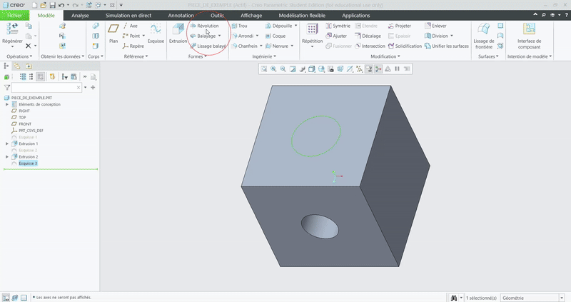
 

### 4) Les Arrondis et Les Chanfreins 
Ces deux fonctions, malgré leur importance, sont parfois oubliées, et c'est dommage, car si elles sont bien appliquées, elles peuvent :

  - Rendre la pièce plus solide
  - La rendre plus jolie et ergonomique
  - Améliorer la qualité d'impression avec l'imprimante 3D

**Donc à favoriser leurs utilisation !** 
Mais que font-elles si elles sont aussi importantes ? Pas grand-chose, en fait, juste :

  - Les arrondis : rendent les arêtes rondes.
  - Les chanfreins : rendent les arêtes plates.

Très souvent, quand on les applique, on enlève de la matière dans les endroits où elle est trop inutile et on en rajoute là où il en manque.

**Attention !** Pour savoir dans quels cas les utiliser, lire absolument : [Tips de Meca](tips-de-meca.md))

Alors, comment les appliquer ? C'est très simple :

  - Appuyer sur "Arrondi" (ou "Chanfrein" si vous avez besoin de cela).
  - En gardant appuyé le Ctrl, appuyer sur les arêtes qui vous intéressent.
  - Ajouter le rayon d’arrondi désiré (idem pour le "Chanfrein", mais au lieu du rayon, il faut modifier une longueur).

Si vous faites cela, vous verrez que Creo a créé un groupe nommé "Jeu 1". Si vous relâchez Ctrl et appuyez sur une nouvelle arête, puis refaites toutes les opérations décrites précédemment, il créera un nouveau groupe : "Jeu 2". L'intérêt de ces groupes est d'avoir plusieurs arrondis/chanfreins qui sont faciles à modifier en modifiant le groupe, sans avoir à les modifier un par un.

Voici à quoi cela doit ressembler :

  
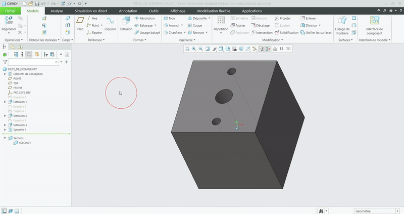
 

### 5) La Répétition et La Symétrie
Puisque vous êtes en train de lire ce guide, j'ose supposer que vous faites partie de Club Robot. D'où, une autre supposition courageuse : vous n'aimez pas trop les actions répétitives. Si c'est le cas, je vous félicite, car Creo nous permet d'éviter de faire plusieurs fois la même action avec ces deux fonctions : "Répétition" et "Symétrie".

#### a) La Répétition
Il y a plusieurs options de "Répétition", mais nous allons nous concentrer sur deux d'entre elles :

  - Répétition de direction : très pratique pour couvrir une surface. Pour le faire, il faut :

  1) Choisir la fonction à répéter (l'extrusion, la révolution, les arrondis, les symétries, et même les autres répétitions).
  2) Appuyer sur "Répétition".
  3) En haut à gauche, choisir le type : Direction.
  4) Choisir la direction 1.
  5) Choisir la direction 2 s'il y en a une (c'est pour couvrir toute la surface).
  6) Donner le nombre de membres dans la direction 1 (c'est-à-dire combien de fois répéter la fonction dans cette direction, y compris la fonction initiale).
  7) Idem pour la direction 2 s'il y en a une.
  8) Donner l'espacement entre les membres (la distance entre chaque membre de la répétition).
  9) Idem pour la direction 2 s'il y en a une.
  10) Apprécier le résultat (ne pas abuser si vous avez de la trypophobie).

Voici un exemple :

  
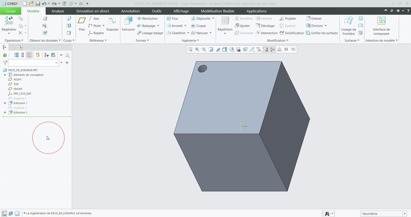
 

  - Répetition d'axe : propagation autours d'une axe, très pratique pour les trous de vis. Pour le faire, il faut :

    1) Choisir la fonction à répéter (l'extrusion, la révolution, les arrondis, les symétries, et même les autres répétitions).
    2) Appuyer sur "Répétition"
    3) En haut à gauche, choisir le type : Axe.
    4) Choisir l'axe de Répétion
    5) Choisir le nombre de membres de répétition
    6) Choisir l'angle qui separe ces membres
    7) Apprècier le résultat de votre travail
       
  **Important !** Ne pas faire plus de membres qu'il ne faut. Par exemple, si vous avez 120° d'angle entre les membres, ça ne sert à rien d'en mettre plus que 360°/120 = 3, car cela entraîne des superpositions de trous et des erreurs plus tard (pas fou-fou).

Voici un exemple : 

  
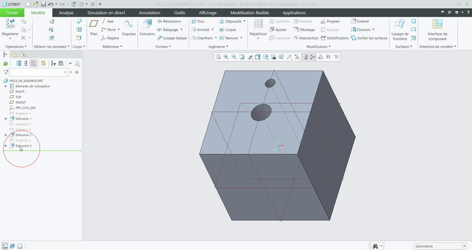
 
#### b) La Symétrie
La fonction "Symétrie" est très proche de la "Répétition", sauf qu'elle reproduit la réflexion par rapport à un plan (comme un miroir en fait).

Pour l'utiliser il faut : 
  1) Choisir la fonction à répéter (l'extrusion, la révolution, les arrondis, les répétitions, et même les autres symétries).
  2) Appuyer sur "Symétrie"
  3) Choisir le plan de symétrie
  4) Apprècier le résultat

Voici un exemple : 

  
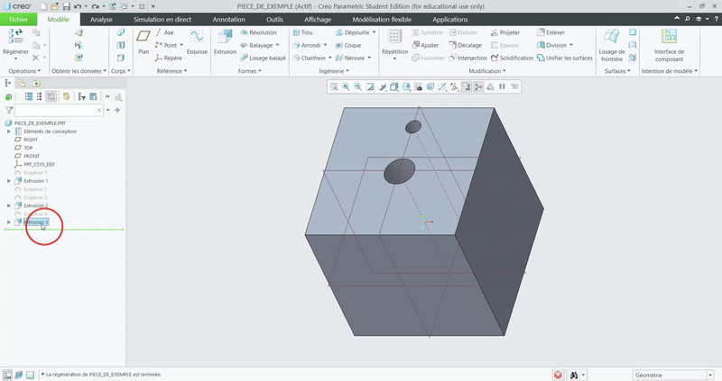
 

### 6) Mesurer

Quand vous aurez besoin de mesurer quelque chose, par exemple une distance, un rayon, un angle ou une surface, vous allez utiliser notre règle magique.

Pour l'utiliser :

  - Pour mesurer une longueur, un rayon ou tout autre paramètre unique, il faut :
  1) Appuyer sur "Mesurer".
  2) Appuyer sur l'objet à mesurer.
  3) Se dire, "WoW, tellement bien fait !".

  - Pour mesurer une distance, un décalage d'angle ou tout autre paramètre lié à deux entités :
  1) Appuyer sur "Mesurer".
  2) Appuyer sur la référence 1 de la mesure.
  3) En gardant le Ctrl appuyé, appuyer sur la référence 2 de la mesure.
  4) Tadaaah

  Voici un exemple: 
  
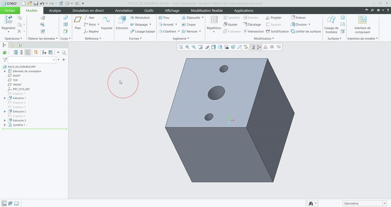
 

### 7) Les Apparences et Les Sections

Ces deux fonctions ne sont pas indispensables, mais elles aident à mieux visualiser nos pièces.

  - Les Apparences : sont comme la peinture sur les surfaces choisies (cela peut être des couleurs ou des matériaux). Pour les utiliser, il faut :
    1) Choisir les surfaces à peindre.
    2) Appuyer sur la fonction "Apparences" (pas l'icône de boule, mais bien le mot "Apparences" avec la flèche).
    3) Taper la couleur/le matériau dans la barre de recherche (en anglais !) ou choisir parmi ceux proposés.
    4) Apprécier la beauté de l'art que vous venez de créer.
  
Voici un exemple avec du fer (j'ai tapé "Iron" dans la barre de recherche) :

  
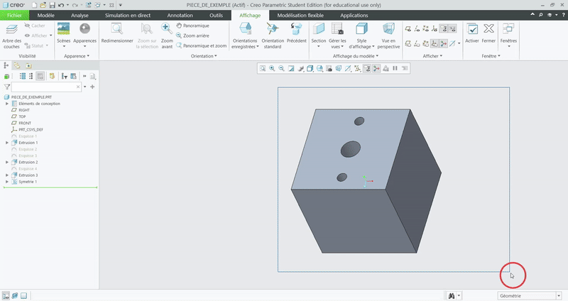
 

  - Les sections : servent à découper la pièce pour voir son intérieur sans la modifier. Pour les utiliser, il faut :
    
    1) Appuyer sur la fonction "Section".
    2) Choisir le plan auquel la section doit être parallèle.
    3) Bouger la souris ou taper manuellement en haut pour choisir la profondeur de la section.
    4) Masquer la section si vous n'en avez plus besoin et souhaitez continuer votre modélisation.

Voici un exemple :

  
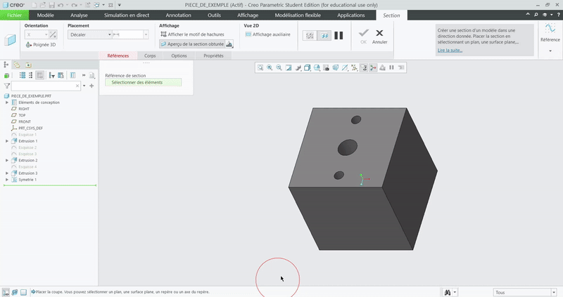
 
    
### 8) Le Render Studio
Ça y est, vous avez fini votre magnifique pièce ou assemblage ? Vous avez envie de la partager avec vos collègues pour leur demander leur avis ? Bonne idée ! Mais il faut le faire proprement.

 

Après avoir appliqué vos apparences, vous allez lancer le "Render Studio".

L'utilisation est simple :

  Appuyer sur "Render Studio" dans Applications.
  - Ensuite, appuyer sur "Rendu".
  - Choisir l'emplacement et le nom du fichier.
  - Choisir le format :
    - JPEG : si vous voulez garder l'arrière-plan.
    - PNG : si vous voulez un arrière-plan transparent (il faudra également appuyer sur "Inclure Alpha" pour cela).
  - Ensuite, choisir l'un des deux :
    - Le nombre d'échantillons (plus il y en a, meilleure sera la qualité de l'image ; à partir de 500, la qualité est suffisante).
    - La durée de rendu (environ 30 secondes suffisent).
  - Envoyer à votre secrétaire de club pour qu'il fasse de jolis posts sur les réseaux sociaux.

Voici un exemple : 

  

 

Et pour comparer le résultat : à gauche on n'a que 6 echantillons alors qu'à droite on en a 500. 

  
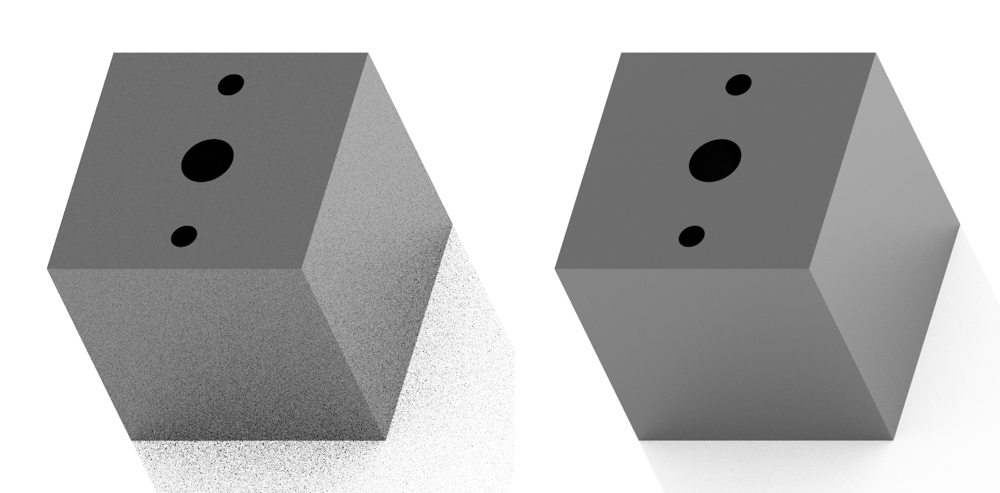
 

### 9) L'Assemblage

Pour finir, le coup de grâce : le moment où toutes vos pièces vont se rassembler pour former une entité, un monstre de Frankenstein, une amalgamation d'imaginations humaines... autrement dit, le robot !  
La création de l'assemblage est identique à celle d'une pièce, avec la seule différence qu'il faut choisir "Assemblage" au lieu de "Pièce" dans la fenêtre de sélection. 

 

Commençons par le commencement : la première pièce. 
 
La première pièce est la base de votre assemblage et elle est censée être fixe, donc c'est à vous de fixer cette pièce en premier.

Pour cela, il faut :
  
  1) Appuyer sur "Assemblage".
  2) Choisir la pièce dans la liste.
  3) Choisir l'origine de l'assemblage dans l'arbre de navigation.
  4) Choisir l'origine de la pièce dans l'arbre de navigation.
  5) Vérifier que la pièce a bien changé de couleur, car si la pièce est :
    - Violette : elle n'est pas fixe (il y a des contraintes à ajouter).
    - Orange : elle est fixe (il n'y a pas besoin de contraintes supplémentaires, mais vous pouvez la réorienter avec une dernière contrainte).
  6) Appuyer sur OK.
**À noter !** Pour que l'assemblage reste fonctionnel même après le redémarrage de Creo, il faut que toutes les pièces se retrouvent dans le même dossier que l'assemblage (**et pas dans des sous-dossiers !** Sinon Creo va perdre les pièces). De plus, on peut faire des assemblages avec d'autres assemblages (pour l'assemblage maître, l'assemblage importé est considéré comme une pièce).

Voici la démonstration : 

  
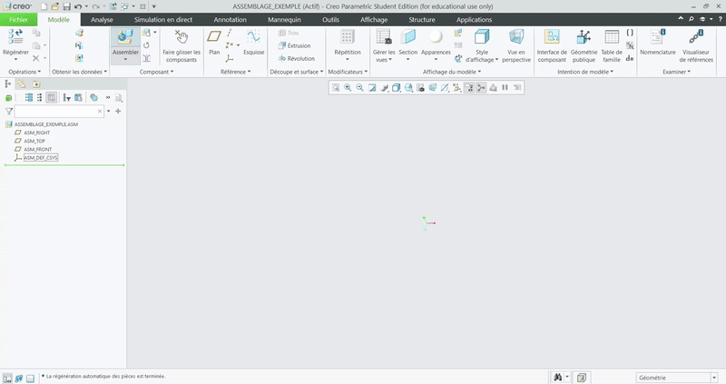
 

Quand la pièce de base sera fixée, nous allons ajouter les autres, et c'est là que nous parlerons des "Restrictions" (Contraintes). Ce sont les liaisons entre deux pièces ou deux références (ex. les faces, les arêtes, les axes, etc.) qui permettent de construire l'assemblage.

Il y en a 10 au total, mais les plus utilisées sont :
  
  - Coincident : lorsque les deux références sont collées
  - Distance : similaire à coincident, mais avec une distance spécifiée
    **Attention !** Cela ne signifie pas que toutes les directions sont bloquées, la restriction s'applique uniquement aux références choisies.
    Par exemple, si vous bloquez deux faces, cela revient à mettre en contact deux plans infinis. Il faut donc ajouter d'autres contraintes (coincident ou
    distance) pour fixer la pièce
  - Orienté : lorsque deux cylindres ou axes sont imposés d'être coaxiaux
  - Parallèle : lorsque l'on ne veut pas fixer l'objet mais plutôt encadrer ses déplacements
  - Décalage d'angle : comme son nom l'indique, cela permet d'imposer un décalage d'angle entre deux références
Normalement, ces 5 contraintes suffisent largement pour effectuer toutes les opérations nécessaires
 
Très souvent, vous n'aurez même pas besoin de choisir le type de restriction, car Creo comprend rapidement ce que vous voulez faire. Et s'il interprète mal vos besoins, vous pouvez choisir dans la liste et corriger.

Pour ajouter de nouvelles pièces à la base et appliquer les restrictions, il faut :
  
  1) Appuyer sur "Assemblage".
  2) Choisir la pièce dans la liste.
  3) Choisir la référence à fixer sur la pièce.
  4) Choisir la référence à fixer sur la base.
  5) Appuyer sur "Nouvelle restriction" (si vous avez besoin de continuer).
  6) Refaire les étapes 3 et 4.
  7) Répéter jusqu'à ce que la pièce devienne orange (couleur d'une pièce fixe).

Voici un exemple :

  
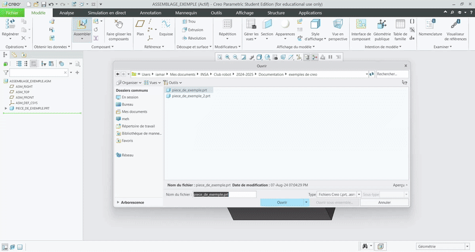
 

**Cas particulier :** si vous souhaitez rendre vos assemblages mobiles pour voir les éléments du robot en mouvement, il faut laisser la pièce violette lors de l'application des restrictions et laisser libre la référence que vous voulez bouger. Dans l'exemple suivant, j'oriente deux trous, mais je ne fixe pas la distance entre les plans, ce qui me permet, en utilisant la fonction "Faire glisser les composents", de faire ceci :

  
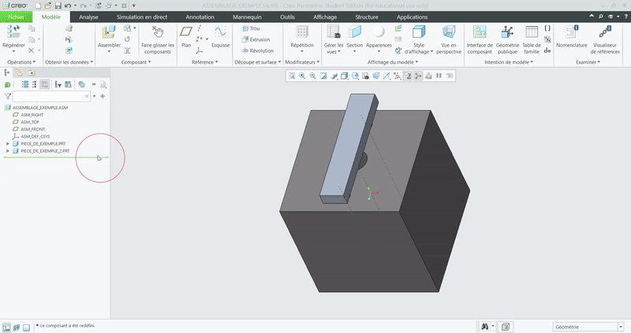
 

Après, quand vous aurez plus d'expérience et que vous aurez compris la logique des "Restrictions" (vous allez vite comprendre après avoir travaillé avec, je ne vois pas l'intérêt de tout détailler ici, c'est très intuitif), vous serez capable de faire des choses de ce genre :

  
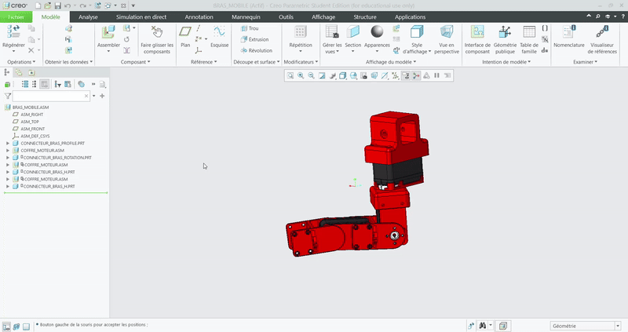
 

Ce n'est pas un chef-d'œuvre, mais c'est quelque chose de pratique qui permet de bouger le mécanisme pour mieux voir les choses à corriger.
